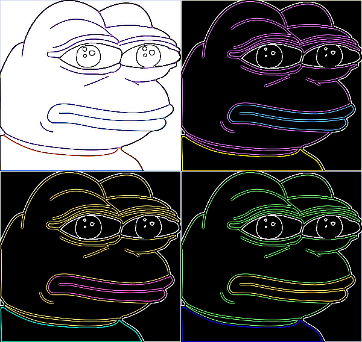
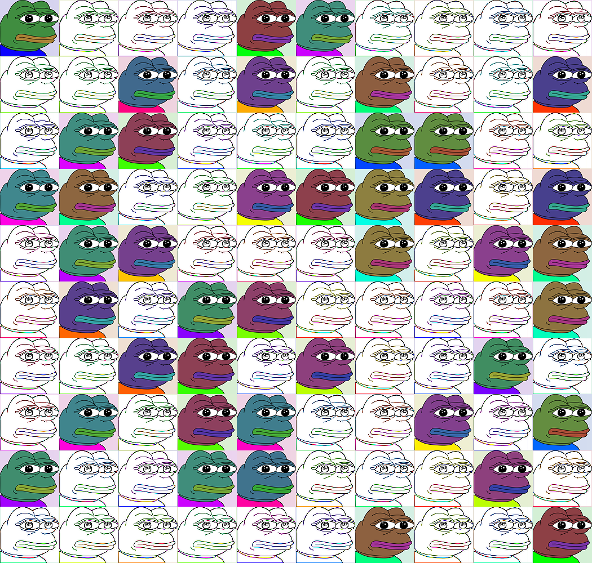
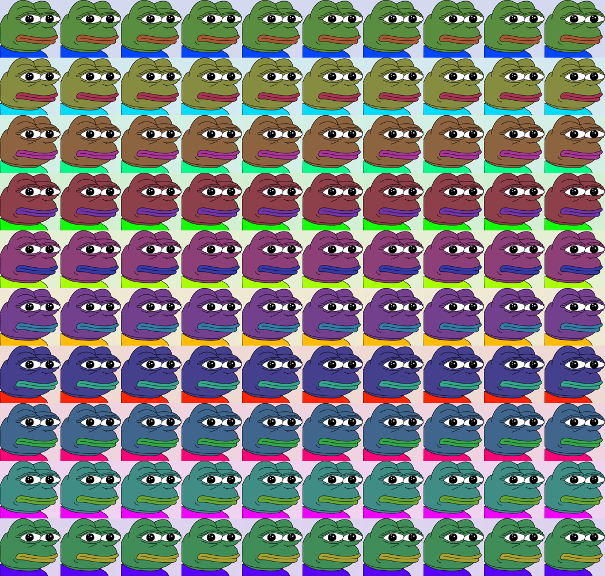

# warhol
A program used to generate Warhol like pop portaits





```
usage: generateWarhol.py [-h] [-i INPUT] [--target-width TARGET_WIDTH] [--target-height TARGET_HEIGHT] [-g GRID_SIZE] [--prioritize-width | --no-prioritize-width] [--blur | --no-blur] [--contour | --no-contour]
                         [--detail | --no-detail] [--emboss | --no-emboss] [--sharpen | --no-sharpen] [--find-edges | --no-find-edges] [--smooth | --no-smooth] [--smooth_more | --no-smooth_more]
                         [--edge_enhance | --no-edge_enhance] [--edge_enhance_more | --no-edge_enhance_more] [--hue-random | --no-hue-random] [--hue-min HUE_MIN] [--hue-max HUE_MAX] [--hue-step HUE_STEP]
                         [--hue-append | --no-hue-append]

A program used to generate Warhol like pop portaits

optional arguments:
  -h, --help            show this help message and exit
  -i INPUT, --input INPUT
                        Filename to read from (default: None)
  --target-width TARGET_WIDTH
                        Width of the resulting image in px. Needs --prioritize-width to be active (default: None)
  --target-height TARGET_HEIGHT
                        Height of the resulting image in px (default: None)
  -g GRID_SIZE, --grid-size GRID_SIZE
                        NxN grid of input images (default: None)
  --prioritize-width, --no-prioritize-width
                        Whether to scale according to the passed argument --target-width or --target-height (default: None)
  --blur, --no-blur
  --contour, --no-contour
  --detail, --no-detail
  --emboss, --no-emboss
  --sharpen, --no-sharpen
  --find-edges, --no-find-edges
  --smooth, --no-smooth
  --smooth_more, --no-smooth_more
  --edge_enhance, --no-edge_enhance
  --edge_enhance_more, --no-edge_enhance_more
  --hue-random, --no-hue-random
                        Whether to generate hue randomly or not. If used, then --hue-step has no effect (default: None)
  --hue-min HUE_MIN     The smallest allowed hue angle (google "HSV color wheel" to learn more) (default: None)
  --hue-max HUE_MAX     The largest allowed hue angle (google "HSV color wheel" to learn more) (default: None)
  --hue-step HUE_STEP   The hue difference step taken every other picture, works only if --hue-random is not being used) (default: None)
  --hue-append, --no-hue-append
                        Whether to add up to the hue from the previous frame or not (default: None)
```